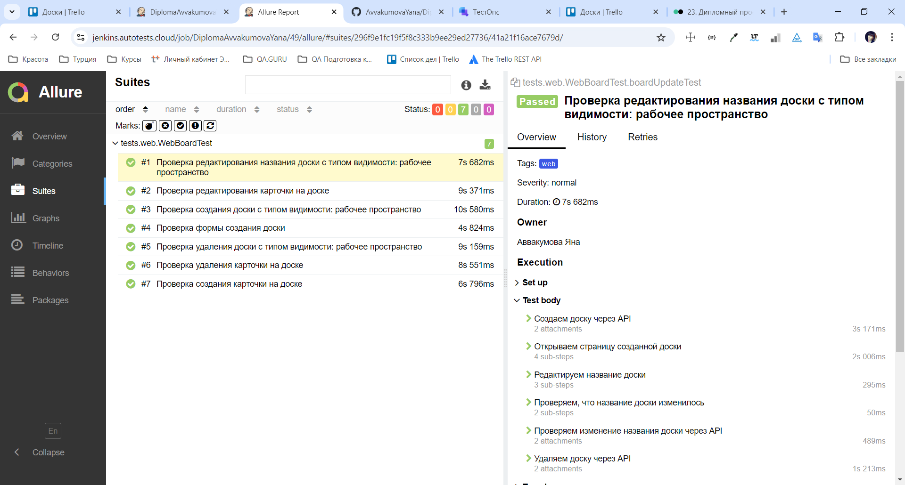

# Проект по автоматизации тестирования для компании [](https://trello.com/)
> Trello — облачная программа для управления проектами небольших групп, разработанная Fog Creek Software. 
---

## Содержание:
+ [Описание проекта и используемый стек](#описание-проекта-и-используемый-стек)
+ [Реализованные проверки](#реализованные-проверки)
+ [Сборка в Jenkins](#-сборка-в-jenkins)
+ [Интеграция с Allure Report](#-интеграция-с-allure-report)
+ [Интеграция с Allure TestOps](#-интеграция-с-allure-testops)
+ [Уведомления в Telegram с использованием бота](#-уведомления-в-telegram-с-использованием-бота)
+ [Видео примера запуска тестов в Selenoid](#-видео-примера-запуска-тестов-в-selenoid)
---

## Описание проекта и используемый стек
<p align="center">
<a href="https://www.jetbrains.com/idea/"></a> 
<a href="https://www.java.com/"></a>
<a href="https://gradle.org/"></a> 
<a href="https://selenide.org/"></a> 
<a href="https://aerokube.com/selenoid/"></a>
<a href="https://rest-assured.io"></a>
<a href="https://github.com/allure-framework/allure2"></a>
<a href="https://qameta.io"></a>
<a href="https://junit.org/junit5/"></a> 
<a href="https://github.com/"></a> 
<a href="https://www.jenkins.io/"></a> 
<a href="https://telegram.org/"></a>  
<a href="https://app-automate.browserstack.com/"></a>  
<a href="https://developer.android.com/studio"></a>   
<a href="https://appium.io"></a>  
<a href="https://www.atlassian.com/software/jira"></a>  
</p>   

- Проект состоит из UI-тестов, API и мобильных тестов для Android
- В данном проекте автотесты написаны на языке `Java`
- В качестве сборщика используется `Gradle`
- Используются фреймворки `JUnit 5` и `Selenide`
- Используется технология `Owner` для придания тестам гибкости и легкости конфигурации
- Используется `Lombok` для моделей в API тестах
- При прогоне UI тестов браузер запускается в `Selenoid`
- Для запуска мобильных тестов удаленно используется `Browserstack`
- Для запуска мобильных тестов локально на эмуляторе или реальном устройстве используются `Appium` и `Android Studio`
- Реализована возможность запуска проектов с помощью `Jenkins`
- Реализована интеграция с `Allure TestOps`
- Настроена отправка уведомлений о результатах прохождения в `Telegram`
- По завершению прохождения автотестов генерируется `Allure` отчет
---

## Реализованные проверки:

### Web
- [x] Проверка формы создания доски
- [x] Проверка создания доски c типом видимости: рабочее пространство
- [x] Проверка редактирования названия доски c типом видимости: рабочее пространство
- [x] Проверка удаления доски c типом видимости: рабочее пространство

### Api
- [x] Проверка создания, редактирования, удаления доски через API

### Mobile
- [x] Проверка авторизации в приложении Trello
---

##  Сборка в [Jenkins](https://jenkins.autotests.cloud/job/C27-girlonthemars-HW23-LeaderTask-Tests-Project/)

* <code>TASK</code> – название запускаемой задачи. По умолчанию - <code>main_web</code>.
* <code>BROWSER</code> – браузер, в котором будут выполняться тесты. По умолчанию - <code>chrome</code>.
* <code>BROWSER_VERSION</code> – версия браузера, в которой будут выполняться тесты. По умолчанию - <code>-</code>.
* <code>BROWSER_SIZE</code> – размер окна браузера, в котором будут выполняться тесты. По умолчанию - <code>1920x1080</code>.
* <code>Wdhost</code> – адрес selenoid для удаленного запуска тестов. 
* <code>ApiKey</code> – ключ для доступа к Api. 
* <code>ApiToken</code> – токен для доступа к Api.
  
***Параметры запуска:***
```
clean
${TEST_TASK}
-DBrowser=${BROWSER}
-DChromeVersion=${CHROME_VERSION}
-DFirefoxVersion=${FIREFOX_VERSION}
-DBrowserSize=${BROWSER_SIZE}
-DWdhost=${WDHOST}
-Dapikey=${ApiKey}
-Dapitoken=${ApiToken}
```
Для запуска сборки необходимо перейти в раздел <code>Собрать с параметрами</code>, задать параметры и нажать кнопку <code>Собрать</code>.

<p align="center">
 

</p>

После выполнения сборки, в блоке <code>История сборок</code> напротив номера сборки появится значок <code>Allure Report</code>, при клике на который открывается страница со сформированным html-отчетом,
а так же значок <code>Allure TestOps</code> при клике на который открывается страница проекта в <code>Allure TestOps</code>.

<p align="center">

</p>

---
##  Интеграция с [Allure Report](https://jenkins.autotests.cloud/job/C27-girlonthemars-HW23-LeaderTask-Tests-Project/allure/)
`Allure Report` - инструмент для генерации и визуализации отчетов о выполнении тестов, который позволяет представлять результаты тестирования в наглядной и удобной форме.

### Диаграмма прохождения тестов

<p align="center">  
  
</p>  

### Развернутый результат прохождения тестов

<p align="center">  
  
</p>

---
##  Интеграция с [Allure TestOps](https://allure.autotests.cloud/project/4369/dashboards)
`Allure TestOps` - платформа для управления тестированием, которая предоставляет обширный набор для организации, выполнения и анализа тестов в проектах.

<p align="center">  
  
</p>

---
##  Уведомления в Telegram с использованием бота

После завершения сборки специальный бот автоматически отправляет сообщение с отчетом о прогоне тестов в `Telegram`.

<p align="center">

</p>

---
##  Видео примера запуска тестов в Selenoid

В отчетах Allure для каждого теста прикреплен не только скриншот, но и видео прохождения теста.
<p align="center">
  
</p>
